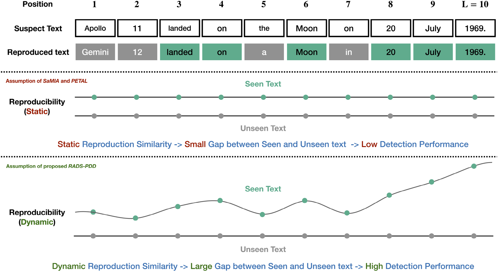
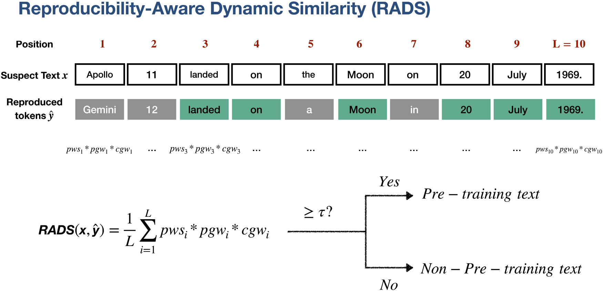
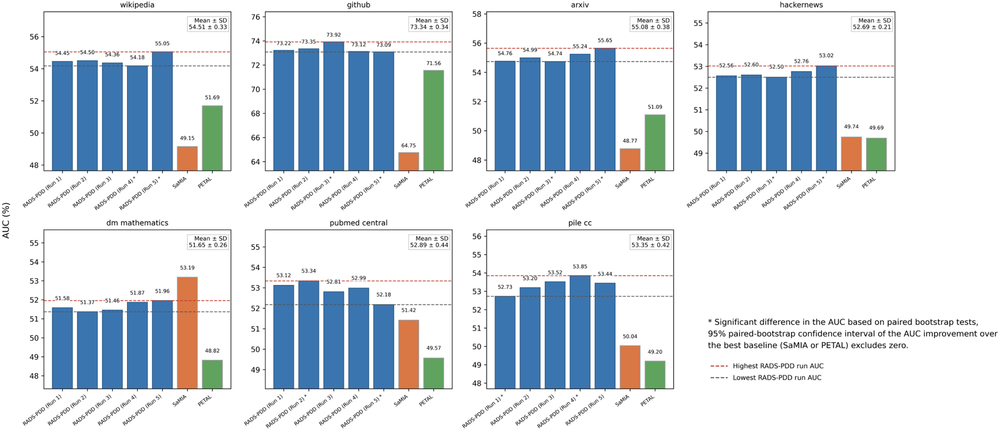

# RADS-PDD

## Reproducibility-aware Dynamic Similarity-based Pre-training Data Detection against LLMs

[](https://doi.org/10.1016/j.neunet.2026.109393)
[](https://creativecommons.org/licenses/by/4.0/)
[](https://doi.org/10.1016/j.neunet.2026.109393)

**Xin Fan**, Ryoto Miyamoto, Fan Mo, Chongxian Chen, Tsuneo Matsumoto, Fuyuko Kido, and Hayato Yamana

*Neural Networks*, Volume 205, Article 109393. [[Paper]](https://doi.org/10.1016/j.neunet.2026.109393) [[PubMed]](https://pubmed.ncbi.nlm.nih.gov/42480164/)

> RADS-PDD detects whether a suspect text appeared in an LLM's pre-training data using only the model's final textual outputs. It models how reproducibility changes across token positions, contiguous spans, and expressions instead of compressing reproduction behavior into a single static similarity score.

<p align="center">
  
</p>

## Motivation

Pre-training data may contain copyrighted material, private information, or benchmark test examples. Detecting this content is therefore important for data provenance, privacy auditing, and trustworthy model evaluation.

Most existing detection methods require intermediate model signals such as token probabilities, perplexity, or loss. Those signals are generally unavailable when an LLM is accessed through a commercial API. Existing output-only methods are more practical, but they often treat reproduction similarity as static and overlook how an LLM's ability to reproduce a text changes during generation.

RADS-PDD starts from a different observation: **reproducibility is dynamic, and it varies differently for seen and unseen texts**.

## Method

<p align="center">
  
</p>

RADS-PDD combines sampling-based verbatim reproduction with three interpretable mechanisms:

1. **Sampling-based verbatim reproduction** - At each token position, the LLM is queried using the ground-truth prefix. Multiple next-token samples approximate the model's observable reproduction behavior without accessing internal probabilities.
2. **Positional gain weight** - Later matches receive greater emphasis because longer ground-truth context makes memorized text increasingly reproducible.
3. **Continual gain weight** - Consecutive correct spans are rewarded and consecutive incorrect spans are penalized, capturing span-level evidence of memorization.
4. **Triplet occurrence probability** - Matches on rare expressions receive more weight, while common expressions that are easy to generate without prior exposure are down-weighted.

The resulting score accumulates weighted evidence across the full reproduction sequence:

$$
\mathrm{RADS}(x, \hat{y}) = \frac{1}{L}\sum_{i=1}^{L} pws_i \cdot pgw_i \cdot cgw_i.
$$

A threshold on this score produces the final pre-training/non-pre-training decision.

## Main findings

- **Strict black-box setting:** RADS-PDD needs only final generated tokens, making it applicable to closed commercial LLMs.
- **Consistent gains over output-only baselines:** Across WikiMIA and MIMIR, RADS-PDD outperforms SaMIA and PETAL in most evaluated settings.
- **Strong low-FPR performance:** On the practically important TPR@5%FPR metric, RADS-PDD reports average improvements of **16.67% over SaMIA** and **12.10% over PETAL**.
- **Competitive with grey-box methods:** Despite not using perplexity, token likelihoods, or model loss, RADS-PDD is competitive with methods that require intermediate outputs.
- **Robust behavior:** Experiments across random seeds, model scales, text lengths, and domains support the stability of sampling-based dynamic similarity.

<p align="center">
  
</p>

## Evaluation

| Component | Setting |
|---|---|
| Benchmarks | WikiMIA and MIMIR |
| Access assumption | Final LLM outputs only |
| Metrics | AUC, balanced accuracy, and TPR@5%FPR |
| Black-box baselines | SaMIA and PETAL |
| Grey-box baselines | PPL variants, Min-K%, Min-K++%, DC-PDD, RECALL, and related methods |
| Coverage | Multiple LLM families, model scales, text lengths, and data domains |

## Repository status

This repository currently serves as the project page for the paper and provides its visual overview. The reference implementation, experiment configurations, and reproduction instructions have not yet been released here.

## Citation

If you find this work useful, please cite:

```bibtex
@article{fan2027radspdd,
  title   = {RADS-PDD: Reproducibility-aware dynamic similarity-based pre-training data detection against LLMs},
  author  = {Fan, Xin and Miyamoto, Ryoto and Mo, Fan and Chen, Chongxian and Matsumoto, Tsuneo and Kido, Fuyuko and Yamana, Hayato},
  journal = {Neural Networks},
  volume  = {205},
  pages   = {109393},
  year    = {2027},
  doi     = {10.1016/j.neunet.2026.109393}
}
```

## License and attribution

The paper is published open access under the [Creative Commons Attribution 4.0 International License](https://creativecommons.org/licenses/by/4.0/). Figures reproduced in `assets/` are taken from the paper and retain the same attribution requirements.

Paper and figures: © 2026 The Authors. Published by Elsevier Ltd. under CC BY 4.0.
